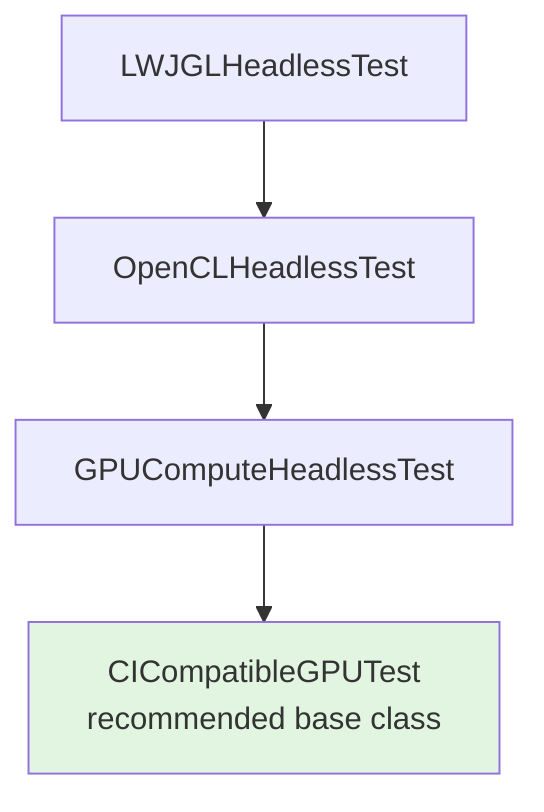

# GPU Support Framework

[](https://github.com/Hellblazer/gpu-support/actions/workflows/maven.yml)
[](https://www.gnu.org/licenses/agpl-3.0)

A production-ready GPU resource management and testing framework for Java, providing RAII-based resource lifecycle management and comprehensive CI/CD-compatible GPU testing infrastructure for OpenCL, OpenGL, and Metal compute workloads.

## Overview

The GPU Support Framework consists of two primary modules designed for the [Luciferase](https://github.com/Hellblazer/Luciferase) spatial computing project:

- **[Resource Management](resource/)** - RAII-based GPU resource lifecycle with memory pooling and leak detection
- **[GPU Test Framework](gpu-test-framework/)** - Headless GPU testing with automatic CI/CD compatibility

Built on LWJGL 3.3.6, targeting Java 25, and designed for cross-platform GPU compute applications.

## Key Features

### Resource Management
- RAII Pattern: Automatic resource cleanup using Java's `AutoCloseable`
- Memory Pooling: Efficient ByteBuffer pooling with configurable eviction policies (LRU/FIFO/LFU)
- Leak Detection: Built-in resource leak tracking and detailed reporting
- Thread-Safe: Concurrent access support with fine-grained synchronization
- Performance Monitoring: Real-time resource usage statistics

### GPU Test Framework
- Multi-Backend Support: OpenCL, OpenGL Compute, Metal 3
- Headless Operation: Runs without display, suitable for CI/CD
- CI/CD Compatible: Automatic mock fallback when GPU unavailable
- Performance Benchmarking: Built-in CPU vs GPU comparison with JMH
- Cross-Validation: Verify GPU and CPU implementations match
- Graceful Degradation: Tests skip when GPU hardware unavailable

## Quick Start

### Prerequisites

- **Java**: 25 or later (GraalVM 25.0.1+ recommended)
- **Maven**: 3.9+
- **GPU Drivers** (optional for development):
  - OpenCL 1.2+ drivers for GPU testing
  - Tests gracefully skip in CI environments without GPU

### Installation

#### From GitHub Packages

Add the GitHub Packages repository and dependencies to your Maven project:

```xml
<repositories>
    <repository>
        <id>github</id>
        <url>https://maven.pkg.github.com/Hellblazer/gpu-support</url>
    </repository>
</repositories>

<dependencies>
    <!-- Resource Management -->
    <dependency>
        <groupId>com.hellblazer.gpu-support</groupId>
        <artifactId>resource</artifactId>
        <version>0.0.1-SNAPSHOT</version>
    </dependency>

    <!-- GPU Test Framework (test scope) -->
    <dependency>
        <groupId>com.hellblazer.gpu-support</groupId>
        <artifactId>gpu-test-framework</artifactId>
        <version>0.0.1-SNAPSHOT</version>
        <scope>test</scope>
    </dependency>
</dependencies>
```

**Authentication:** Configure your `~/.m2/settings.xml` with a GitHub Personal Access Token:

```xml
<settings>
    <servers>
        <server>
            <id>github</id>
            <username>YOUR_GITHUB_USERNAME</username>
            <password>YOUR_GITHUB_TOKEN</password>
        </server>
    </servers>
</settings>
```

Generate a token at [GitHub Settings → Developer settings → Personal access tokens](https://github.com/settings/tokens) with `read:packages` scope.

### Build from Source

```bash
# Clone the repository
git clone https://github.com/Hellblazer/gpu-support.git
cd gpu-support

# Build and test
./mvnw clean install

# Run tests (skips GPU tests in CI automatically)
./mvnw test

# Run only resource module tests
./mvnw test -pl resource

# Run platform validation (recommended first run)
./mvnw test -Dtest=HeadlessPlatformValidationTest
```

## Usage Examples

### Resource Management

```java
import com.hellblazer.luciferase.resource.*;

// Create manager with configuration
var config = ResourceConfiguration.builder()
    .maxPoolSizeBytes(100 * 1024 * 1024)  // 100MB pool
    .maxIdleTime(Duration.ofMinutes(5))
    .enableLeakDetection(true)
    .build();

var manager = new UnifiedResourceManager(config);

// Allocate memory from pool
ByteBuffer buffer = manager.allocateMemory(4096);

// Use buffer for GPU operations...

// Return to pool for reuse
manager.releaseMemory(buffer);

// Periodic maintenance
manager.performMaintenance();

// Cleanup
manager.close();
```

### GPU Testing

```java
import com.hellblazer.gpu.test.CICompatibleGPUTest;
import org.junit.jupiter.api.Test;

public class MyGPUTest extends CICompatibleGPUTest {

    @Test
    void testGPUKernel() {
        var platforms = discoverPlatforms();
        // Automatically skips when OpenCL unavailable (e.g., in CI)

        var platform = platforms.get(0);
        if (MockPlatform.isMockPlatform(platform)) {
            log.info("Using mock platform - skipping GPU test");
            return;
        }

        var gpuDevices = discoverDevices(platform.platformId(), CL_DEVICE_TYPE_GPU);
        var device = gpuDevices.get(0);

        // Your GPU kernel test here
        testGPUVectorAddition(platform.platformId(), device.deviceId());
    }
}
```

## Architecture

### Module Structure

```
gpu-support/
├── resource/                    # Resource lifecycle management
│   ├── src/main/java/
│   │   └── com/hellblazer/luciferase/resource/
│   │       ├── UnifiedResourceManager.java
│   │       ├── ResourceHandle.java
│   │       ├── MemoryPool.java
│   │       ├── ResourceTracker.java
│   │       ├── opencl/          # OpenCL resource handles
│   │       └── opengl/          # OpenGL resource handles
│   └── README.md
│
├── gpu-test-framework/          # GPU testing infrastructure
│   ├── src/main/java/
│   │   └── com/hellblazer/gpu/test/
│   │       ├── CICompatibleGPUTest.java
│   │       ├── GPUComputeHeadlessTest.java
│   │       ├── OpenCLHeadlessTest.java
│   │       ├── MockPlatform.java
│   │       └── support/
│   ├── src/test/java/          # Example tests
│   ├── README.md
│   └── USAGE_GUIDE.md
│
├── docs/                        # Additional documentation
└── README.md                    # This file
```

### Core Concepts

#### Resource Management (RAII Pattern)

The framework implements Resource Acquisition Is Initialization (RAII) in Java:

```java
public abstract class ResourceHandle<T> implements AutoCloseable {
    protected abstract void doCleanup(T resource);

    @Override
    public final void close() {
        if (state.compareAndSet(ResourceState.ALLOCATED, ResourceState.CLOSED)) {
            doCleanup(resource);
            tracker.unregister(this);
        }
    }
}
```

Always use try-with-resources for automatic cleanup:

```java
try (var buffer = manager.createBuffer(data)) {
    // Use buffer - automatically released on close
}
```

#### GPU Test Hierarchy



- **`LWJGLHeadlessTest`**: Base for all LWJGL headless tests
- **`OpenCLHeadlessTest`**: OpenCL initialization/cleanup
- **`GPUComputeHeadlessTest`**: Platform/device discovery
- **`CICompatibleGPUTest`**: Automatic CI compatibility with mock fallback

## Configuration

### JVM Requirements

The build automatically configures these JVM arguments for all tests:

- `--enable-native-access=ALL-UNNAMED` - Required for LWJGL native library loading
- `--add-modules jdk.incubator.vector` - Enables Vector API for SIMD operations
- `--add-opens java.base/java.lang=ALL-UNNAMED` - Required for LWJGL reflection
- `--add-opens java.base/java.nio=ALL-UNNAMED` - Required for LWJGL ByteBuffer operations

### Resource Configuration

```java
var config = ResourceConfiguration.builder()
    .maxPoolSizeBytes(200 * 1024 * 1024)  // 200MB pool
    .maxIdleTime(Duration.ofMinutes(10))
    .enableLeakDetection(true)
    .evictionPolicy(EvictionPolicy.LRU)
    .build();
```

### Supported Platforms

The framework supports native libraries for:

- **macOS**: ARM64 (Apple Silicon), x86_64 (Intel)
- **Linux**: AMD64, ARM64
- **Windows**: AMD64

Native libraries are automatically selected by Maven based on your platform.

## Testing

### Running Tests

```bash
# All tests
./mvnw test

# Resource module only
./mvnw test -pl resource

# GPU test framework only
./mvnw test -pl gpu-test-framework

# Platform validation (run first!)
./mvnw test -Dtest=HeadlessPlatformValidationTest

# Parallel testing (resource module: 2-3x faster)
./mvnw test -pl resource -Pparallel-tests

# Performance benchmarks
./mvnw test -Pgpu-benchmark
```

### CI/CD Behavior

In CI environments without GPU drivers:
- Resource module: 21 OpenCL tests skip gracefully
- GPU Test Framework: All GPU-dependent tests skip
- Mock Platform: Automatically used for testing framework logic
- Build Status: Succeeds with informative skip messages

### Expected Warnings

The following warnings in logs are expected and documented:

**LWJGL Unsafe API Deprecation** (safe to ignore - upstream LWJGL issue):
```
WARNING: sun.misc.Unsafe::objectFieldOffset has been called by org.lwjgl.system.MemoryUtil
WARNING: sun.misc.Unsafe::objectFieldOffset will be removed in a future release
```

**Incubator Module Usage** (expected - Vector API):
```
WARNING: Using incubator modules: jdk.incubator.vector
```

See [CLAUDE.md](CLAUDE.md) for complete JVM requirements and known issues.

## Performance

### Resource Management Benchmarks

- **Pool Allocation**: ~100ns per buffer from pool
- **Pool Release**: ~50ns to return to pool
- **Overhead**: <5% vs direct allocation
- **Pool Hit Rate**: Typically >90% in production workloads

### GPU Performance Testing

The framework includes:
- CPU vs GPU comparison benchmarks
- Memory transfer overhead profiling
- Cross-validation between implementations
- Automatic result verification

## Documentation

### Primary Documentation
- **[Resource Module README](resource/README.md)** - Detailed resource management guide
- **[GPU Test Framework README](gpu-test-framework/README.md)** - Testing framework overview
- **[Usage Guide](gpu-test-framework/USAGE_GUIDE.md)** - Comprehensive usage examples
- **[CLAUDE.md](CLAUDE.md)** - Development guide for Claude Code

### Additional Resources
- **[Contributing Guidelines](CONTRIBUTING.md)** - How to contribute (coming soon)
- **[API Documentation](https://hellblazer.github.io/gpu-support/)** - JavaDoc (coming soon)

## Integration with Luciferase

This framework is designed for GPU acceleration in the [Luciferase](https://github.com/Hellblazer/Luciferase) project:

- **ESVO Ray Traversal**: Efficient Sparse Voxel Octree GPU kernels
- **Spatial Index Operations**: Parallel tree traversal and queries
- **Collision Detection**: GPU-accelerated broad and narrow phase
- **Voxel Rendering**: Compute shaders for real-time rendering
- **Memory Bandwidth Testing**: Profiling large octree structures

## Troubleshooting

### Common Issues

**"No OpenCL platforms found"**
- Normal on systems without OpenCL drivers
- Tests will skip gracefully
- Use mock platform for development

**"Duplicate system property warnings"**
- Fixed in recent versions
- Update to latest version

**ARM64 JVM stack tests may fail**
- Expected limitation on ARM64
- Library functions work correctly
- Can be safely ignored

### Getting Help

1. Check the module-specific README files
2. Review the [CLAUDE.md](CLAUDE.md) for known issues
3. Run platform validation: `./mvnw test -Dtest=HeadlessPlatformValidationTest`
4. Enable debug logging for detailed diagnostics

### Debug Logging

Enable detailed resource tracking:

```xml
<logger name="com.hellblazer.luciferase.resource" level="DEBUG"/>
<logger name="com.hellblazer.gpu.test" level="DEBUG"/>
```

## Roadmap

- [ ] Vulkan API support
- [ ] Metal compute shader support (beyond bgfx)
- [ ] Distributed resource management
- [ ] Advanced eviction policies
- [ ] Resource usage prediction
- [ ] Automatic pool sizing
- [ ] WebGPU backend

## Contributing

Contributions are welcome! Please:

1. Fork the repository
2. Create a feature branch
3. Add tests for new functionality
4. Ensure all tests pass: `./mvnw clean install`
5. Submit a pull request

Please follow the existing code style and add appropriate documentation.

## License

Licensed under [AGPL v3.0](LICENSE)

Copyright © 2025 Hal Hildebrand

## Acknowledgments

- Built with [LWJGL 3.3.6](https://www.lwjgl.org/)
- Designed for the [Luciferase](https://github.com/Hellblazer/Luciferase) spatial computing project
- Inspired by modern C++ RAII patterns adapted for Java

## Contact

- **Author**: Hal Hildebrand
- **Project**: [github.com/Hellblazer/gpu-support](https://github.com/Hellblazer/gpu-support)
- **Issues**: [GitHub Issues](https://github.com/Hellblazer/gpu-support/issues)

---

**Note**: This framework requires Java 25+ and is actively developed for the Luciferase project. GPU drivers are optional - the framework gracefully handles systems without GPU hardware through automatic mock implementations.
