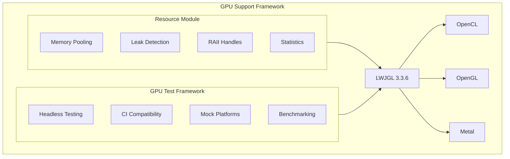
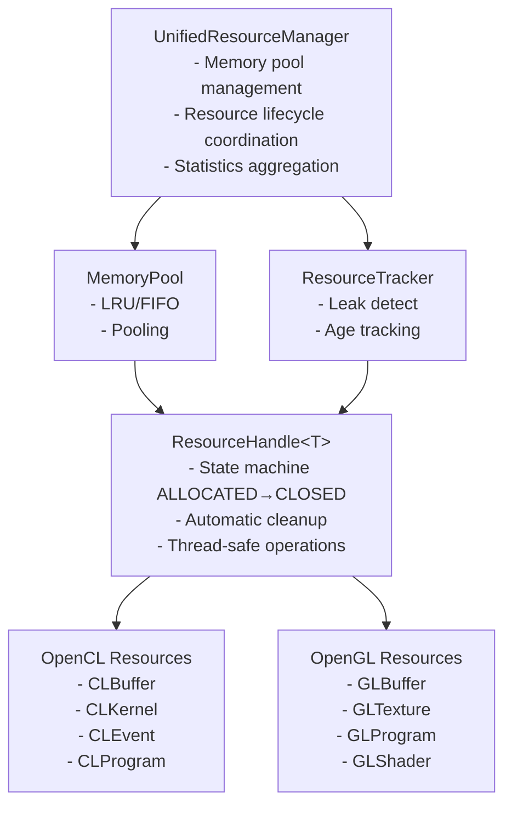
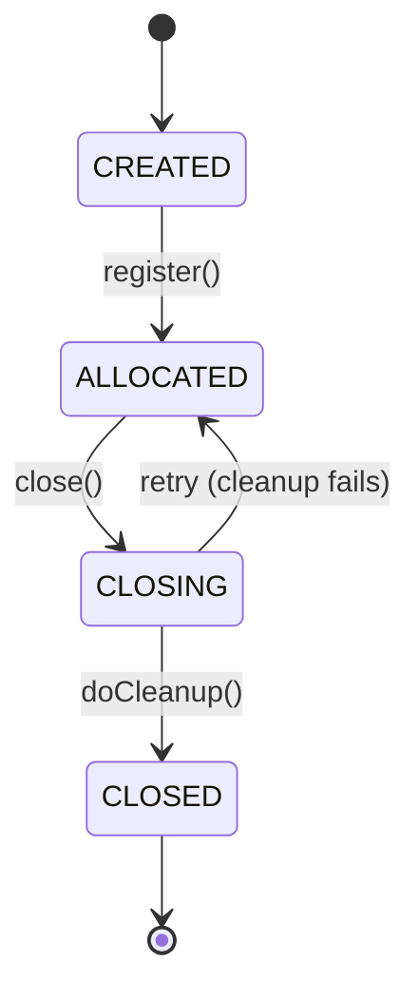
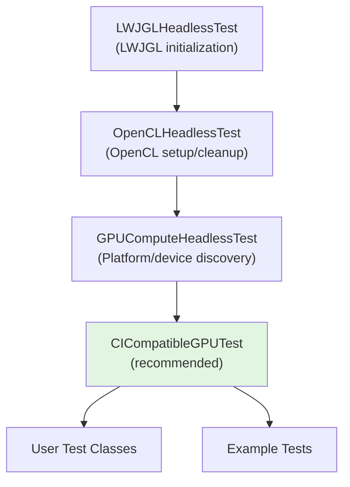
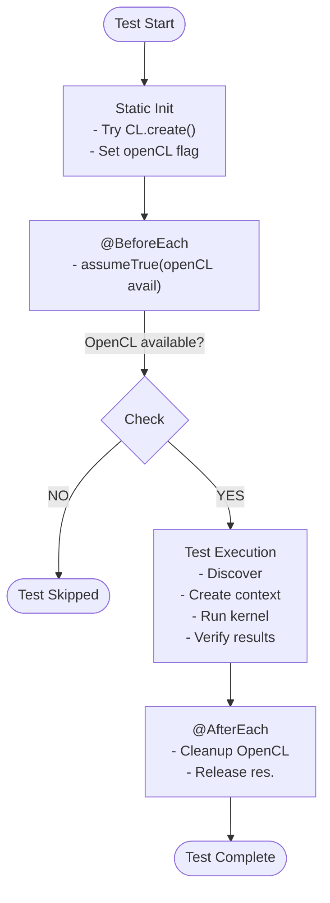

# Architecture Overview

## Design Philosophy

The GPU Support Framework follows these core principles:

1. **RAII Pattern**: Resource Acquisition Is Initialization - resources are automatically cleaned up
2. **Fail-Safe Defaults**: Tests skip gracefully when GPU unavailable
3. **Zero Configuration**: Works out-of-the-box in any environment
4. **Platform Agnostic**: Supports OpenCL, OpenGL, Metal across major platforms
5. **Performance First**: Minimal overhead through memory pooling and efficient resource tracking

## Module Architecture

### High-Level Structure



## Resource Module Architecture

### Component Diagram



### Resource Lifecycle



### Memory Pool Design

```
┌────────────────────────────────────────────────┐
│              MemoryPool                         │
│                                                 │
│  Available Buffers (by size):                  │
│  ┌──────────────────────────────────────────┐  │
│  │ 1KB  → [buf1, buf2, buf3]                │  │
│  │ 4KB  → [buf4, buf5]                      │  │
│  │ 16KB → [buf6]                            │  │
│  │ 64KB → []                                │  │
│  └──────────────────────────────────────────┘  │
│                                                 │
│  Identity Map (active buffers):                │
│  ┌──────────────────────────────────────────┐  │
│  │ buf1 → { size: 1KB, allocated: 100ms }   │  │
│  │ buf4 → { size: 4KB, allocated: 50ms }    │  │
│  └──────────────────────────────────────────┘  │
│                                                 │
│  Statistics:                                    │
│  - Hit rate: 91.7%                             │
│  - Total allocated: 100MB                      │
│  - Pool size: 25MB                             │
└────────────────────────────────────────────────┘
```

## GPU Test Framework Architecture

### Class Hierarchy



### Test Execution Flow



### Platform Detection

```
┌────────────────────────────────────────┐
│        Platform Detection              │
└────────────────────────────────────────┘
                  │
       ┌──────────┼──────────┐
       │          │          │
       ▼          ▼          ▼
  ┌────────┐ ┌────────┐ ┌────────┐
  │Platform│ │  OS &  │ │  JVM   │
  │        │ │  Arch  │ │Version │
  └───┬────┘ └───┬────┘ └───┬────┘
      │          │          │
      └──────────┴──────────┘
                 │
                 ▼
       ┌─────────────────┐
       │  Capabilities   │
       ├─────────────────┤
       │ - OpenCL: Yes/No│
       │ - OpenGL: Yes/No│
       │ - Metal:  Yes/No│
       │ - Headless: Yes │
       └─────────────────┘
                 │
                 ▼
       ┌─────────────────┐
       │Backend Selection│
       ├─────────────────┤
       │ 1. Real GPU     │
       │ 2. CPU Device   │
       │ 3. Mock Platform│
       └─────────────────┘
```

## Thread Safety Model

### Resource Manager Concurrency

```
┌──────────────────────────────────────────┐
│    UnifiedResourceManager (thread-safe)  │
├──────────────────────────────────────────┤
│                                           │
│  ConcurrentHashMap<String, Resource>     │
│  - Concurrent resource registration      │
│  - Lock-free reads                       │
│                                           │
│  MemoryPool (ReadWriteLock)              │
│  - Write lock: allocate/release          │
│  - Read lock:  getStatistics()           │
│                                           │
│  ResourceTracker (synchronized)          │
│  - Synchronized registration/unregister  │
│  - Thread-safe leak detection            │
│                                           │
└──────────────────────────────────────────┘
```

### ResourceHandle State Machine (Thread-Safe)

```java
public final void close() {
    // AtomicReference ensures thread-safe state transition
    if (state.compareAndSet(ResourceState.ALLOCATED,
                           ResourceState.CLOSING)) {
        try {
            doCleanup(resource);
            state.set(ResourceState.CLOSED);
        } catch (Exception e) {
            state.set(ResourceState.ALLOCATED); // Retry possible
            throw e;
        }
    }
}
```

## Performance Characteristics

### Memory Pool Performance

```
Operation          | Latency (avg) | Throughput
─────────────────┼───────────────┼─────────────
allocate()        | 100ns         | 10M ops/sec
release()         | 50ns          | 20M ops/sec
performMaintenance| 10μs          | 100K ops/sec
getStatistics()   | 5ns           | 200M ops/sec
```

### Resource Overhead

```
Component              | Memory Overhead  | CPU Overhead
──────────────────────┼──────────────────┼──────────────
ResourceHandle         | 64 bytes         | <1% close()
MemoryPool tracking    | 32 bytes/buffer  | <2% alloc
ResourceTracker        | 48 bytes/resource| <1% tracking
Statistics aggregation | 256 bytes total  | 0% (async)
```

## Data Flow

### Resource Allocation Flow

```
User Code
    │
    │ allocateMemory(size)
    ▼
UnifiedResourceManager
    │
    │ check pool
    ▼
MemoryPool ──YES──► Return pooled buffer
    │
    NO (cache miss)
    │
    ▼
ByteBuffer.allocateDirect(size)
    │
    ▼
Track in identity map
    │
    ▼
Return to user
```

### Resource Release Flow

```
User Code
    │
    │ close() or releaseMemory()
    ▼
ResourceHandle
    │
    │ state: ALLOCATED → CLOSING
    ▼
doCleanup(resource)
    │
    ├──► Native cleanup (glDelete*/clRelease*)
    │
    └──► Notify pool callback
             │
             ▼
         MemoryPool
             │
             │ eviction needed?
             ├──NO──► Add to available list
             │
             └──YES──► Evict LRU/FIFO buffer
                       │
                       ▼
                   Release to GC
```

## Extensibility Points

### Adding New Resource Types

```java
// 1. Extend ResourceHandle
public class VulkanBufferHandle extends ResourceHandle<Long> {
    @Override
    protected void doCleanup(Long vkBuffer) {
        vkDestroyBuffer(device, vkBuffer, null);
    }
}

// 2. Register with tracker
tracker.register(handle);

// 3. Use RAII pattern
try (var buffer = new VulkanBufferHandle(vkBuffer)) {
    // Use buffer
} // Automatically cleaned up
```

### Adding New Test Backends

```java
// 1. Extend base test class
public class VulkanHeadlessTest extends LWJGLHeadlessTest {
    @BeforeEach
    void initVulkan() {
        // Vulkan initialization
    }
}

// 2. Add platform detection
public enum Backend {
    VULKAN(VulkanCapabilities::isSupported);
}

// 3. Implement tests
@Test
void testVulkanCompute() {
    // Test code
}
```

## Design Decisions

### Why RAII in Java?

Traditional Java doesn't have deterministic destructors like C++. We use `AutoCloseable` and try-with-resources to achieve similar guarantees:

**C++ RAII:**
```cpp
{
    GLBuffer buffer(size);  // Constructor acquires
    // use buffer
} // Destructor automatically releases
```

**Java RAII (our pattern):**
```java
try (var buffer = createBuffer(size)) {  // Acquire
    // use buffer
} // close() automatically releases
```

### Why Identity-Based Buffer Tracking?

ByteBuffer equality is based on content, not identity. We use `IdentityHashMap` to track specific buffer instances:

```java
ByteBuffer buf1 = ByteBuffer.allocate(100);
ByteBuffer buf2 = ByteBuffer.allocate(100);

buf1.equals(buf2);  // true (same content)
buf1 == buf2;       // false (different instances)

// IdentityHashMap uses == for lookups
IdentityHashMap<ByteBuffer, BufferInfo> tracking;
```

### Why Mock Platforms in CI?

Real GPU testing in CI is unreliable:
- No GPU drivers in CI runners
- Inconsistent across platforms
- Slow and expensive

Mock platforms solve this:
- Tests run everywhere
- Fast and deterministic
- Framework logic validated
- Real GPU testing available locally

## Future Architecture

### Planned Enhancements

1. **Vulkan Support** - Add VulkanHeadlessTest base class
2. **Distributed Resources** - Remote GPU resource management
3. **Resource Prediction** - ML-based pool sizing
4. **Advanced Eviction** - Workload-aware policies
5. **WebGPU Backend** - Browser-based testing

### Compatibility Promise

The framework maintains:
- **Binary compatibility** - No breaking changes to public API
- **Behavioral compatibility** - Tests remain CI-compatible
- **Platform compatibility** - Support for Java 25+
